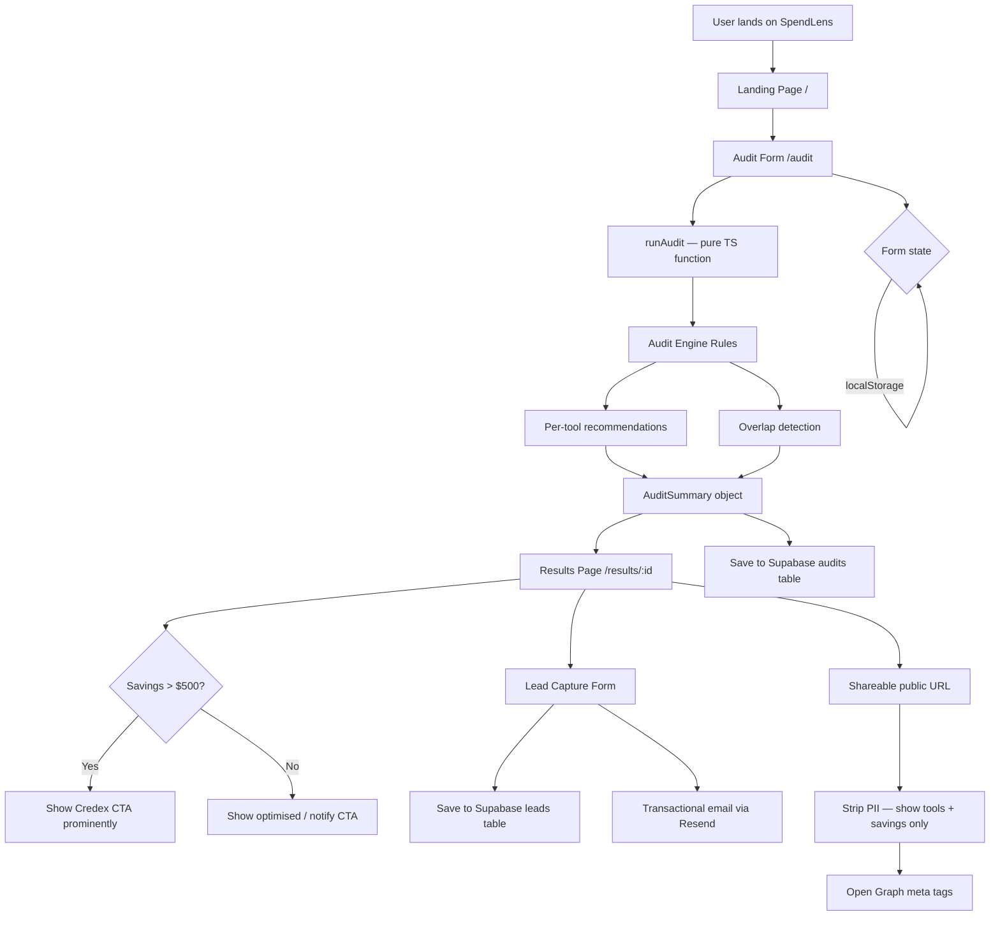

# ARCHITECTURE.md

## System Diagram



---

## Data Flow: Input → Audit Result

1. **User fills form** (`/audit`) — selects tools, plans, seat counts, monthly spend, team size, use case
2. **Form state persists** to `localStorage` under key `spendlens_form` — survives page reload
3. **Submit** calls `runAudit(formData)` — a pure TypeScript function with no side effects
4. **Audit engine** runs per-tool rule functions, then `detectOverlaps()` which may mutate results
5. **AuditSummary** is returned — contains `toolResults[]`, total savings, savings category
6. **ID generated** with `nanoid(10)` — e.g. `aB3xK2pLmN`
7. **Saved to Supabase** `audits` table (non-blocking — UI doesn't wait)
8. **Stored in sessionStorage** for immediate results page load (no network round-trip)
9. **Navigate to** `/results/:id` — reads from sessionStorage first, falls back to Supabase
10. **Lead captured** → written to `leads` table → Resend sends transactional confirmation email

---

## Stack Choices & Justification

### React + Vite (not Next.js)
- This is a client-side audit tool — there's no SEO-sensitive content that needs SSR
- Vite's HMR is significantly faster than Next.js for development iteration
- No server needed — the audit engine is pure client-side logic
- Simpler deployment: static files on Vercel, no server/edge functions billing

### TypeScript
- The audit engine has complex branching logic — types catch bugs at compile time
- `RecommendationType` and `ToolId` union types prevent entire classes of runtime errors
- Required by the assignment spec (strongly preferred)

### Tailwind CSS
- Utility-first CSS keeps component files self-contained — no separate `.module.css` files to manage
- Extremely fast to iterate on design during a 7-day sprint
- The `@tailwindcss/vite` plugin integrates cleanly without PostCSS config overhead

### Supabase (not Firebase/Postgres)
- Postgres under the hood — relational, queryable, no vendor lock-in on data format
- Free tier is generous enough for MVP traffic
- Row-level security keeps lead data safe without a custom auth layer
- REST + JS client means no server-side code needed

### Resend (not Postmark/SES)
- Best developer experience for transactional email in 2025
- Free tier: 3,000 emails/month — more than enough for MVP
- React Email compatible if we add HTML templates later

### React Router DOM
- Client-side routing for `/audit` and `/results/:id`
- Enables shareable URLs without server-side rendering

---

## Database Schema (Supabase)

```sql
-- audits: one row per audit run
create table audits (
  id text primary key,
  audit_data jsonb not null,
  audit_summary jsonb not null,
  created_at timestamptz default now(),
  email text,
  company_name text,
  role text
);

-- leads: one row per email capture
create table leads (
  id uuid primary key default gen_random_uuid(),
  audit_id text references audits(id),
  email text not null,
  company_name text,
  role text,
  team_size int,
  total_monthly_savings numeric,
  created_at timestamptz default now()
);

-- RLS: public can insert, only service role can select
alter table audits enable row level security;
alter table leads enable row level security;

create policy "Public audits insert" on audits for insert with check (true);
create policy "Public audits select by id" on audits for select using (true);
create policy "Public leads insert" on leads for insert with check (true);
```

---

## What Would Change at 10k Audits/Day

1. **Rate limiting**: Add Upstash Redis rate limiter on the lead capture endpoint (currently just a honeypot)
2. **Edge caching**: Cache audit results at Vercel Edge for shared URLs — most shared audits are read-only
3. **Queue email sends**: Move Resend calls to a background queue (Inngest or Trigger.dev) so lead capture doesn't wait on email delivery
4. **Analytics pipeline**: Stream audit data to a warehouse (Tinybird or ClickHouse) for real-time savings benchmarks — this enables the "benchmark mode" bonus feature
5. **Supabase connection pooling**: Enable PgBouncer in Supabase to handle concurrent inserts without exhausting Postgres connections
6. **OG image generation**: Pre-generate Open Graph images server-side (Vercel OG) instead of relying on meta tags alone — better social sharing at scale
